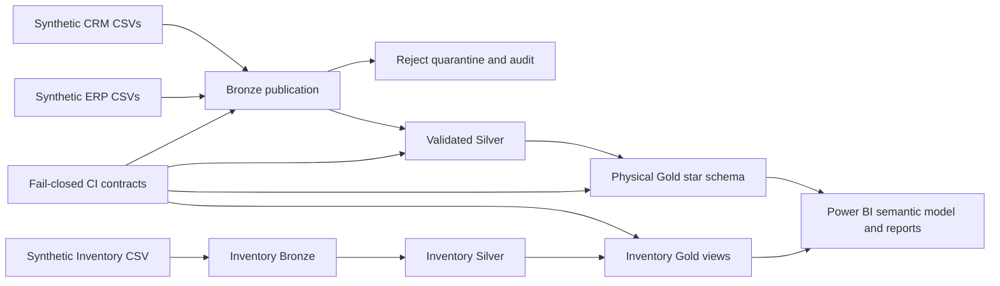

# SQL Data Warehouse

A production-oriented Microsoft SQL Server and Power BI reference implementation for developing, operating, validating, documenting, and extending a data warehouse. All committed data is synthetic; this repository demonstrates engineering capability and does not claim a production deployment or employment experience.

## What the repository demonstrates

- Audited Bronze/Silver loading for six CRM and ERP extracts with transactions, application locks, restart linkage, immutable source versions, watermarks, durable step metrics, quarantine evidence, and fail-closed error propagation.
- A physical Gold star schema with surrogate keys, Unknown members, SCD2 product resolution, a conformed date dimension, primary/foreign/check constraints, stable reruns, and workload indexes.
- A complete new-source onboarding example for Inventory: source contract, Bronze loader, Silver parsing/mapping/quarantine, Gold views, idempotency tests, data-quality gates, and Power BI integration.
- A source-controlled Power BI Project (PBIP/PBIR/TMDL) with explicit DAX measures, KPI catalog, report pages, responsive layouts, refresh parameters, RLS reference logic, accessibility metadata, and automated source validation.
- Fail-closed CI on a pinned SQL Server 2022 image, including positive contracts, targeted negative self-tests, runtime/model/Inventory verification, and container cleanup.
- Architecture, lineage, source-to-target mapping, data catalog, dependency analysis, performance evidence, operational runbooks, legacy-object inventory, deprecation procedure, change requests, and implementation proposals.

## Qualification and activity coverage

| Professional activity | Repository evidence |
| --- | --- |
| Develop and extend a DWH | `scripts/bronze_layer/`, `scripts/silver_layer/`, `scripts/gold_layer/` |
| Analyze existing structures and dependencies | `scripts/analysis/`, `docs/data/dependency_analysis.md` |
| Model analytical data | `docs/data-model/`, physical `gold.dim_*` and `gold.fact_*` objects |
| Integrate a new source | `datasets/source_inventory/`, `scripts/source_inventory/` |
| Improve data quality and plausibility | `control.load_reject`, `tests/quality_checks_*.sql`, `docs/quality/` |
| Optimize performance | `scripts/performance/`, `docs/performance/benchmark-evidence.md` |
| Create and extend Power BI reporting | `powerbi/`, `docs/powerbi/`, `docs/kpi/` |
| Review KPIs and measures | `docs/kpi/kpi-catalog.*`, `_Measures.tmdl` |
| Identify obsolete objects and logic | `docs/legacy/legacy_object_inventory.md` and deprecation workflow |
| Troubleshoot and operate pipelines | `docs/operations/runtime-runbook.md`, runtime audit tables and tests |
| Document concepts and proposals | `docs/architecture/`, `docs/project/`, `CONTRIBUTING.md` |

## Architecture



The operational pipeline never drops the database. The destructive development reset is isolated in `scripts/operations/reset_development.sql` and requires its documented confirmation token.

## Technology

- Microsoft SQL Server 2022 reference runtime
- T-SQL and SQLCMD
- Power BI Project format: PBIP, PBIR, and TMDL
- Python 3.10+ for orchestration and repository validators
- Docker and GitHub Actions for isolated CI

## Repository layout

| Path | Purpose |
| --- | --- |
| `datasets/` | Synthetic CRM, ERP, and Inventory source fixtures and contracts |
| `scripts/control/` | Batch, step, watermark, and reject control plane |
| `scripts/operations/` | Safe operational entry point and explicit development reset |
| `scripts/bronze_layer/` | Source staging, validation, quarantine, and atomic Bronze publication |
| `scripts/silver_layer/` | Complete CRM/ERP cleansing and atomic Silver publication |
| `scripts/gold_layer/` | Materialized dimensions, fact, loader, and indexes |
| `scripts/source_inventory/` | End-to-end new-source onboarding example |
| `scripts/performance/` | Opt-in deterministic million-row benchmark |
| `powerbi/` | Source-controlled semantic model and reports |
| `tests/` | Runtime, model, quality, negative, performance, and Inventory contracts |
| `docs/` | Architecture, data, operations, quality, Power BI, KPI, performance, and project evidence |

## Prerequisites

- SQL Server 2022 or a compatible SQL Server instance.
- `sqlcmd` with access to the target instance.
- A server-visible absolute path to `datasets/`; `BULK INSERT` reads from the SQL Server host, not from the client.
- Python 3.10+ for the optional orchestrator and validators.
- Docker for the isolated local CI runner.
- Power BI Desktop for the documented authoring/rendering gate; it is not required for source validation.

## Run the complete pipeline

The canonical SQLCMD entry point bootstraps non-destructively, publishes CRM/ERP Bronze and Silver with audit evidence, loads the physical Gold model, and then loads Inventory.

```powershell
sqlcmd -S localhost -d master -E -b -i scripts/run_pipeline.sql `
  -v BasePath="D:\Git-GitHub\Repositories\SQL-Data-Warehouse\datasets" `
     SourceVersion="synthetic-reference-2026-08-10" `
     SourceWatermark="2026081001" `
     MaxRejectRows="23" `
     RestartOfBatchId="0"
```

`SourceVersion` identifies an immutable delivery. Reusing a successfully published version is audited as `SKIPPED`; a restart must reference a compatible failed batch. Lower `MaxRejectRows` to exercise fail-closed rejection policy.

The Python wrapper calls the same SQLCMD file:

```powershell
python scripts/orchestrate_pipeline.py `
  --server localhost `
  --trusted-connection `
  --base-path "D:\Git-GitHub\Repositories\SQL-Data-Warehouse\datasets" `
  --source-version "synthetic-reference-2026-08-10" `
  --source-watermark 2026081001
```

For SQL authentication, supply `--username` and set `SQLCMDPASSWORD` in the process environment. Passwords are deliberately not accepted on the command line.

## Validate locally and in CI

Run the same isolated SQL Server checks used by GitHub Actions:

```bash
bash scripts/ci/run_ci_checks.sh
```

The runner generates an ephemeral password unless `MSSQL_SA_PASSWORD` is provided, pins the reviewed SQL Server image by digest, mounts the repository read-only, performs targeted negative tests, and removes the container and temporary credential files on exit.

Fast source-only validators:

```powershell
python scripts/ci/check_ci_contract.py
python scripts/powerbi_validation/validate_powerbi_project.py --root . --check-git
python -m unittest discover -s scripts/powerbi_validation/tests -p "test_*.py"
python -m unittest discover -s tests/source_inventory -p "test_*.py"
python -m unittest discover -s scripts/analysis/tests -p "test_*.py"
```

The million-row performance case is opt-in and isolated from the normal pipeline. Follow `docs/performance/benchmark-guide.md`; measured evidence and claim boundaries are recorded in `docs/performance/benchmark-evidence.md`.

## Power BI

Open `powerbi/SQLDataWarehouse.pbip` in a supported Power BI Desktop version. The semantic model reads the curated Gold sales model and the new Inventory Gold views. It includes sales, profitability estimates, fulfillment, data quality, refresh context, Inventory quantities/value/reorder indicators, and country-based reference RLS.

Before treating a build as publishable, complete the Desktop gate in `docs/powerbi/validation.md`: refresh, visual rendering, mobile layouts, interactions, RLS roles, accessibility, and screenshots. No Power BI Service deployment is performed by this repository.

## Data quality and operations

- `control.pipeline_batch` records the overall outcome and restart relationship.
- `control.pipeline_step` records source/target metrics, attempts, watermarks, and failures.
- `control.load_watermark` records the last successful source delivery per source.
- `control.load_reject` records rule, source file, row reference, business key, raw evidence, and remediation message.
- Bronze and Silver publication are transactional; a late failure preserves the previously published state.
- Gold reconciliation is bidirectional and rejects ambiguous product-version matches.

See `docs/operations/runtime-runbook.md` for execution, monitoring, triage, restart, rollback, and recovery guidance.

## Synthetic data and privacy boundary

All committed CRM, ERP, Inventory, users, and email identities are synthetic reference fixtures. Gold hashes customer last names and the semantic model uses reserved `.invalid` identities for RLS examples. Real deployments require an accountable data owner, lawful-purpose review, access design, retention policy, secure secret management, backup/restore testing, environment-specific capacity sizing, and formal Power BI release approval.

## Documentation map

- System design and lineage: `docs/architecture/`
- Data catalog, mapping, dependencies, and source onboarding: `docs/data/`
- Analytical model and deployment: `docs/data-model/`
- Runtime operations: `docs/operations/`
- CI and data quality: `docs/quality/`
- Power BI and KPI governance: `docs/powerbi/`, `docs/kpi/`
- Performance benchmark: `docs/performance/`
- Legacy-object inventory and removal process: `docs/legacy/`
- Scope, attribution, change requests, and proposals: `docs/project/`

## License and attribution

Licensed under the MIT License. See `License.txt`, `NOTICE.md`, and `docs/project/attribution.md` for the upstream tutorial attribution and the repository's extension boundary.
