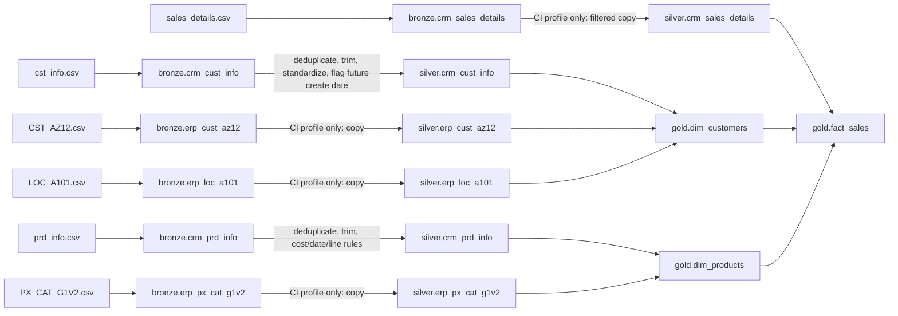
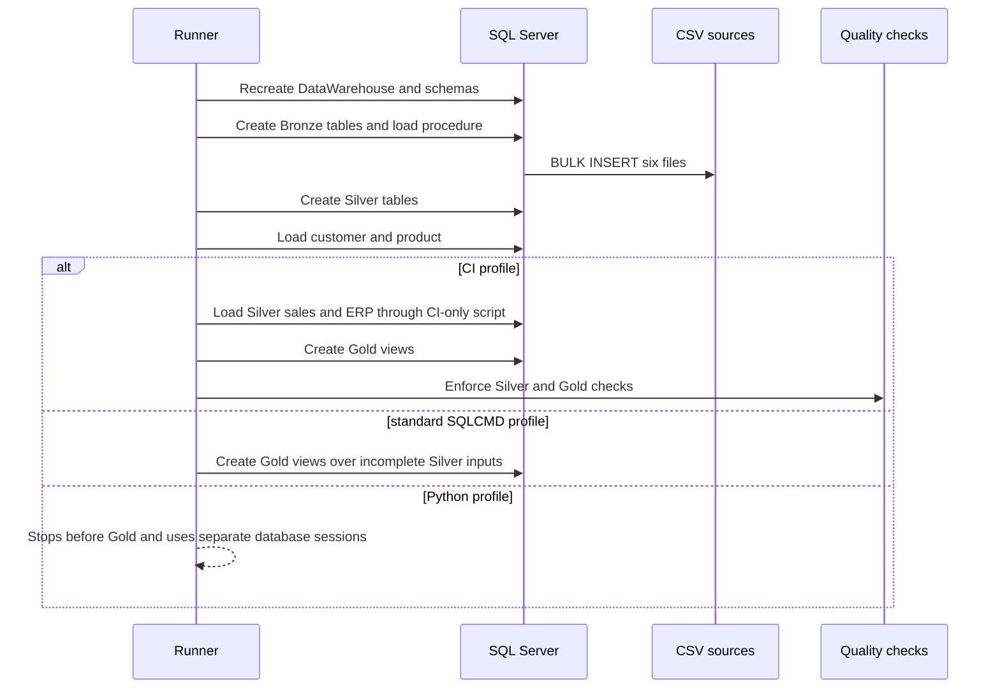

# Data lineage

## Lineage contract

Lineage is documented per execution profile because combining all repository
scripts into one theoretical graph would overstate current behavior. Solid
edges below are implemented in the named profile; missing edges are explicit
gaps. File-to-Bronze loading is ordinal.

## Source-to-presentation lineage

The standard SQLCMD profile has no implemented Bronze-to-Silver edge for sales
or ERP. It therefore creates Gold views over incomplete Silver state. The CI
profile supplies those edges with test-specific logic.

## Customer lineage

1. `datasets/source_crm/cst_info.csv` is loaded by position into
   `bronze.crm_cust_info`; source `cst_*` headings become local `cust_*` columns.
2. Null `cust_id` rows are rejected. `ROW_NUMBER()` retains the row with the
   greatest `cust_create_date` per ID; ties are not deterministically resolved.
3. Names are trimmed. Marital and gender codes map to descriptive values or
   `n/a`. Future create dates are flagged, not removed.
4. In CI, ERP demographics and location are copied into Silver.
5. `gold.dim_customers` joins `RIGHT(erp_cust_az12.cid, 10)` and
   `REPLACE(erp_loc_a101.cid, '-', '')` to `cust_key`. Cleaned CRM gender wins
   unless it is `n/a`. Last name is exposed only as a SHA-256 hex digest.
6. `customer_key` is a query-time row number ordered by `cust_id`.

## Product lineage

1. `prd_info.csv` loads positionally to `bronze.crm_prd_info`.
2. The standard product transform rejects null IDs, retains the latest start
   date per ID, trims key/name, maps null or negative cost to zero, standardizes
   M/R/S/T product-line codes, and nulls an end date earlier than its start.
3. Gold derives category ID from the first five original key characters and
   product number from character seven onward.
4. `gold.dim_products` left-joins the copied CI category table; category fields
   can remain null when no code matches.
5. `product_key` is a query-time row number ordered by `prd_id`.

## Sales lineage

1. `sales_details.csv` loads positionally into Bronze with dates retained as
   `yyyymmdd` integers.
2. Only the CI loader currently populates Silver sales. It copies rows that
   match an already loaded Silver customer and transformed product number.
3. Gold converts nonzero date integers to `DATE` and inner-joins the calculated
   customer and product dimensions.
4. Unmatched rows disappear from `gold.fact_sales`; current tests should be read
   together with source-to-fact row reconciliation to detect that loss.

## Processing and validation sequence

## Evidence limits

This lineage is derived from repository files, not live SQL Server metadata or
query telemetry. Dynamic SQL, permissions, external BI consumers, SQL Agent
jobs, and manually created objects require runtime inspection before impact or
deprecation approval.
