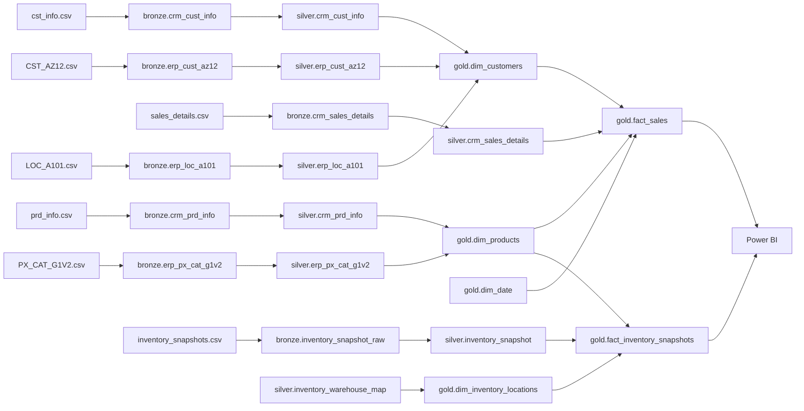
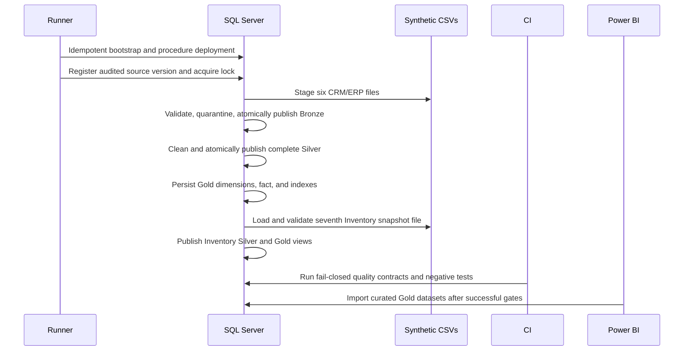

# Data lineage

## Implemented lineage

## Processing sequence

The public SQLCMD/Python runner performs publication and reports end-to-end
batch status; it does not execute the repository's full quality-test suite.
Those fail-closed contracts are executed by CI or explicitly by an operator
before a governed Power BI release.

## Business rules

- Customers: reject missing IDs/keys, select the latest deterministic customer record, standardize domains, enrich from ERP, flag future create dates, and hash last names in Gold.
- Products: validate IDs/keys/cost/dates, preserve product versions, derive SCD2 effective intervals, enrich categories, and enforce at most one current version per product number; a retired product may have none.
- Sales: validate required keys, dates, sequence, and measures; normalize positive price and recompute sales as quantity times normalized price; preserve the accepted order/product grain; resolve customer/product/date surrogate keys; use Unknown members rather than silently dropping unresolved rows.
- Inventory: normalize source and warehouse/product identifiers, map only controlled warehouses and the product version effective on the snapshot date, reject invalid quantities/currency/mapping, deduplicate by extraction timestamp, and derive availability, stock status, and value.

## Audit lineage

`control.pipeline_batch` identifies the core source version, core watermark, status, restart relation, and error. It does not persist `SnapshotAsOf` or a separate Inventory source version. `control.pipeline_step` records Gold and Inventory aggregate results on the end-to-end batch. `control.load_reject` records durable CRM/ERP source, row reference, business key, rule, raw evidence, and remediation message. `control.load_watermark` records the last successfully published Silver delivery per core source; it can point to a batch that later failed in Gold or Inventory.

Inventory uses its own generated `load_batch_id` in Bronze/Silver and exposes
the current accepted and rejected snapshot through
`silver.inventory_snapshot` and `silver.inventory_snapshot_reject`. Both are
replaced by the next Inventory load. The control batch retains aggregate
Inventory step counts and errors, but not a durable row-level Inventory reject
history or an independently governed Inventory version/watermark.

This documentation is repository-derived. Before deprecation or production change, combine it with SQL Server catalog dependencies, job/gateway inventories, external BI lineage, owner confirmation, and an observation window.
