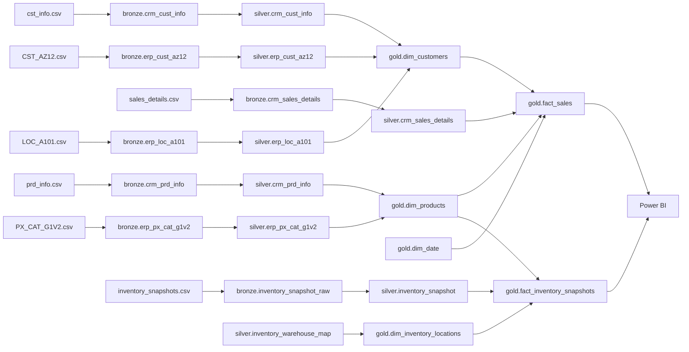
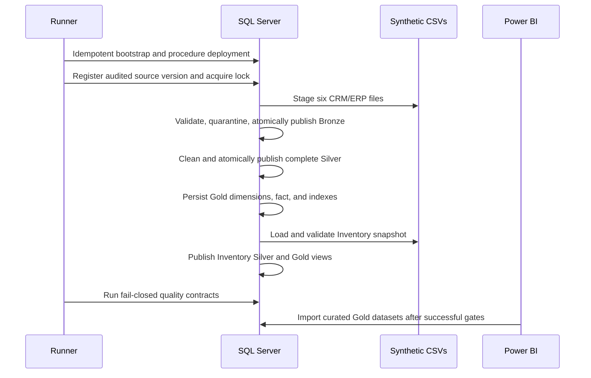

# Data lineage

## Implemented lineage

## Processing sequence

## Business rules

- Customers: reject missing IDs/keys, select the latest deterministic customer record, standardize domains, enrich from ERP, flag future create dates, and hash last names in Gold.
- Products: validate IDs/keys/cost/dates, preserve product versions, derive SCD2 effective intervals, enrich categories, and enforce one current version per product number.
- Sales: validate required keys, dates, sequence, and measures; preserve the accepted order/product grain; resolve customer/product/date surrogate keys; use Unknown members rather than silently dropping unresolved rows.
- Inventory: normalize source and warehouse/product identifiers, map only controlled warehouses and the product version effective on the snapshot date, reject invalid quantities/currency/mapping, deduplicate by extraction timestamp, and derive availability, stock status, and value.

## Audit lineage

`control.pipeline_batch` identifies source version, watermark, status, restart relation, and error. `control.pipeline_step` records attempts and row metrics. `control.load_reject` records source, row reference, business key, rule, raw evidence, and remediation message. `control.load_watermark` records the last successful delivery per core source.

This documentation is repository-derived. Before deprecation or production change, combine it with SQL Server catalog dependencies, job/gateway inventories, external BI lineage, owner confirmation, and an observation window.
