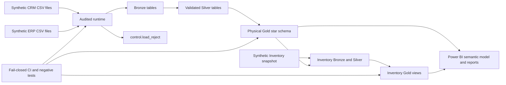
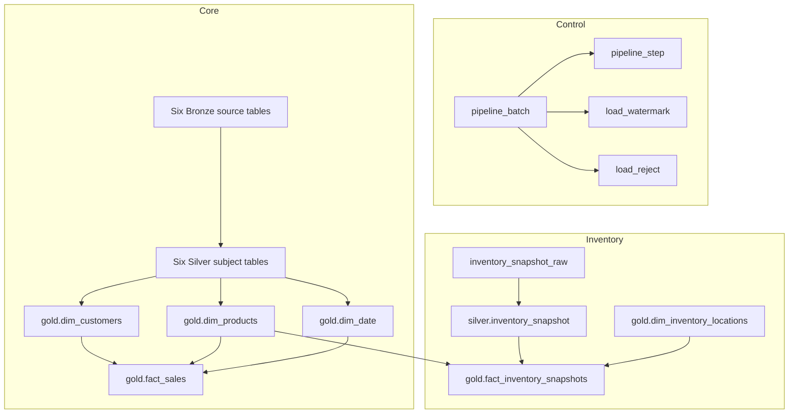

# System architecture

## Scope and maturity

The repository is a production-oriented SQL Server and Power BI reference built entirely from synthetic files. It implements one canonical non-destructive execution path plus an explicitly guarded development reset. It is not evidence of a production deployment.

## System context

## Components

| Component | Responsibility | Primary artifact |
| --- | --- | --- |
| Safe bootstrap | Create database and schemas without dropping published state | `scripts/init.database.sql` |
| Runtime control | Batch, step, watermark, reject, restart, lock, and failure contracts | `scripts/control/create_runtime_control.sql` |
| Bronze publication | Load six CSVs, validate shape/types, quarantine rejects, publish atomically | `bronze.load_bronze` |
| Silver publication | Clean and publish all CRM and ERP subjects atomically | `silver.load_silver` |
| Gold model | Persist customer/product/date dimensions and sales fact with constraints/indexes | `scripts/gold_layer/create_gold_views.sql` |
| New-source onboarding | Load, normalize, map, reject, and publish Inventory snapshots | `scripts/source_inventory/` |
| Power BI | Curated Gold imports, explicit measures, RLS example, report definitions | `powerbi/` |
| Verification | Runtime/model/data-quality/negative/Inventory/performance contracts | `tests/`, `scripts/ci/` |

## Warehouse object model

Gold customer, product, date, and sales objects are physical tables with persisted surrogate keys and trusted constraints. Inventory is published as stable Gold views over typed Silver data and the shared product dimension.

## Execution profiles

| Profile | Behavior | Intended use |
| --- | --- | --- |
| `scripts/run_pipeline.sql` | Canonical CRM/ERP runtime, Gold model, Inventory | SQLCMD/SSMS execution |
| `scripts/orchestrate_pipeline.py` | Calls the same canonical SQLCMD file and keeps passwords out of argv | Local/operator automation |
| `scripts/ci/run_ci_checks.sh` | Pinned isolated SQL Server, positive and negative gates, cleanup | CI and reproducible local verification |
| `scripts/operations/reset_development.sql` | Guarded destructive reset | Disposable development database only |

## Integrity and operational boundaries

- CRM/ERP publication is serialized with an application lock and audited before mutation.
- Failed Bronze or Silver publication preserves the previous published layer and rethrows the original error.
- Every source row is reconciled to Bronze publication or durable quarantine.
- Successful immutable source versions replay as `SKIPPED`; linked restarts require a compatible failed batch.
- Gold rejects ambiguous grains, preserves Unknown members, and supports stable reruns.
- Inventory loading is independently transactional and idempotent.
- Power BI refresh must follow successful warehouse and quality gates.

Production services such as scheduling, alert routing, backups, disaster recovery, gateway binding, Power BI Service deployment, accountable approvals, and environment-specific secrets remain deployment responsibilities.

## Related evidence

- [Data lineage](data_lineage.md)
- [Source-to-target mapping](../data/source_to_target_mapping.md)
- [Data catalog](../data/data_catalog.md)
- [Dependency analysis](../data/dependency_analysis.md)
- [Runtime runbook](../operations/runtime-runbook.md)
