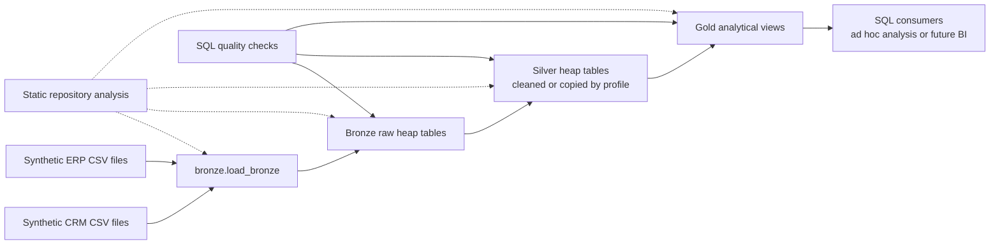
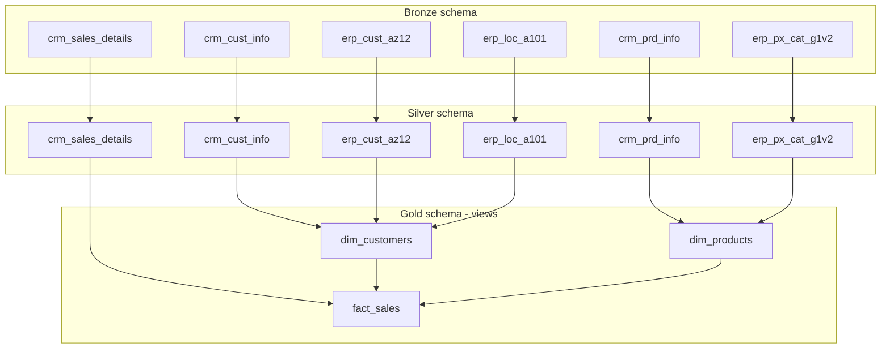

# System architecture

## Scope and status

The repository implements a resettable SQL Server warehouse reference over
synthetic files. It has three logical layers and three non-equivalent execution
profiles. Only the CI profile currently populates every Silver dependency before
creating Gold. The architecture is production-oriented in structure and
verification intent, but it is not a production deployment.

## System context

No Power BI artifact, deployed dashboard, machine-learning model, external API,
or live CRM/ERP connection is present. Such consumers are possible future uses,
not implemented components.

## Components and responsibilities

| Component | Responsibility | Current implementation |
| --- | --- | --- |
| Database bootstrap | Recreate `DataWarehouse`; create layer schemas | `scripts/init.database.sql` |
| Bronze DDL | Define six raw tables without declared keys | `scripts/bronze_layer/create_table_bronze_layer.sql` |
| Bronze loader | Truncate and ordinal-load all six CSVs through dynamic `BULK INSERT` | `scripts/bronze_layer/bulk_insert_crm_cust_info.sql` |
| Standard Silver DDL | Define six tables with load timestamps | `scripts/silver_layer/create_silver_table_structure.sql` |
| Standard Silver transforms | Deduplicate/standardize customers and products | two `cleansing_*.sql` files |
| CI Silver loader | Populate product, sales, and three ERP tables for CI | `scripts/ci/load_ci_silver.sql`; explicitly lightweight and CI-only |
| Gold presentation | Join/enrich into two dimension views and one fact view | `scripts/gold_layer/create_gold_views.sql` |
| Runtime validation | Diagnose Bronze and enforce selected Silver/Gold conditions | SQL files in `tests/` |
| Static validation | Inventory repository objects, references, files, and documentation | `scripts/analysis/` |

## Warehouse object model

Bronze and Silver are physical heap tables. Gold objects are views, not
materialized tables. `customer_key` and `product_key` are calculated with
`ROW_NUMBER()` at query time; they are not persisted identity values.

## Execution profiles

| Profile | Session model | Silver coverage | Gold | Enforced gate | Assessment |
| --- | --- | --- | --- | --- | --- |
| SQLCMD include runner | One SQLCMD session via `:r` | customer + product only | created | none inside runner | incomplete data path |
| Python runner | New `sqlcmd` process for each file | customer + product list | omitted | none | prototype; default database context cannot bootstrap the full path |
| CI runner | One SQLCMD include session plus containers | all six tables, with CI-specific semantics | created | `quality_checks_ci.sql` | only current end-to-end profile |

The CI loader is not evidence of canonical production cleansing: its product
cost rule differs from the dedicated product transformation, and it copies ERP
records without the richer upstream normalization rules.

## Failure and data-integrity boundaries

- Bootstrap and table DDL are destructive: the database and layer tables are
  dropped/recreated. Use disposable instances only.
- The Bronze procedure truncates each table before load. A mid-batch failure can
  leave a partially refreshed warehouse.
- Its `CATCH` block prints errors but does not rethrow them, so process exit
  status alone is insufficient evidence of a successful load.
- CSV-to-Bronze mapping is positional because `BULK INSERT` has no format file.
  Header spelling does not bind columns.
- No primary keys, foreign keys, unique constraints, indexes, or row-level
  security are declared by the current warehouse DDL.
- Gold joins can hide unmatched facts because `fact_sales` uses inner joins;
  missing dimension matches remove rows rather than surface null keys.

## Deployment and operations model

There is no evidenced production environment. CI provisions a disposable SQL
Server container and runs a test-specific pipeline. The repository has no
versioned in-place migrations, backup/restore workflow, secrets platform,
monitoring, alerting, retention policy, access-control model, or service-level
objective. These are explicit maturity boundaries, not implicit features.

## Architecture evidence

- field-level rules: [`source_to_target_mapping.md`](../data/source_to_target_mapping.md)
- object contracts: [`data_catalog.md`](../data/data_catalog.md)
- runner/object dependencies: [`dependency_analysis.md`](../data/dependency_analysis.md)
- proposed improvements: [`implementation_proposals.md`](../project/implementation_proposals.md)
