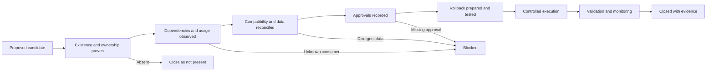

# Deprecation and removal procedure

## Principle

A static legacy signal starts a review; it never authorizes deletion. Removal
requires runtime existence, dependency, data, owner, approval, rollback, and
verification evidence. The current synthetic reset workflow is not a safe model
for deleting objects in a shared or production environment.

## Lifecycle

## Required procedure

### 1. Register

Record the candidate object/file, type, environment, owner, proposed
replacement, rationale, repository evidence, target version, and current state
`proposed`. Do not describe the change as approved or implemented.

### 2. Establish existence and capture state

For SQL Server objects, capture `sys.objects`, `sys.schemas`, `sys.columns`,
`OBJECT_DEFINITION`, create/modify dates, row counts, allocation size,
permissions, indexes, constraints, and extended properties. If the object is
absent, close it as `not present`; do not issue a meaningless drop.

For files, record the exact Git blob, byte size/hash, references, unique content,
and intended owner. A copy-style filename is not duplicate proof.

### 3. Build the dependency and usage envelope

- inspect `sys.sql_expression_dependencies`,
  `sys.dm_sql_referencing_entities`, and `sys.sql_modules`;
- search repository SQL, Python, notebooks, CI, and documentation;
- inspect SQL Agent/SSIS/ADF jobs and deployed configuration;
- obtain owner confirmation for BI, extracts, APIs, and ad hoc users;
- observe a representative reporting cycle (default proposal: 30 days) using
  approved telemetry. Absence of Query Store evidence alone is not proof of no
  consumer.

### 4. Reconcile data and semantics

Compare candidate and replacement row counts, logical-key coverage, null rates,
duplicates, checksums, permissions, and consumer result sets. For historical
`crm_cst_info` → `crm_cust_info`, map every `cst_*` field to `cust_*` and block
on any unexplained divergent row.

### 5. Select migration pattern

- no data and no consumers: controlled direct removal;
- equivalent contract with consumers: migrate consumers or use a time-bounded,
  owned compatibility view with a sunset date;
- divergent data, unknown owner, or unknown consumer: block removal.

Permanent aliases are not an acceptable substitute for completing migration.

### 6. Approve

Record approval from the technical owner/DBA, data owner, affected consumer
owner, and change approver. Add privacy/security/legal review when data class,
access, retention, or licensing changes. Missing accountable approval is a hard
gate.

### 7. Prepare rollback and recovery

Export definitions, permissions, indexes, constraints, and properties. For
data-bearing objects, create a verified backup or controlled quarantine copy
with counts and checksums. Define rollback triggers, owner, maximum restore time,
validation query, and retention window. A Git revert cannot restore dropped
runtime data.

### 8. Execute in dependency order

Switch or disable consumers first. Use schema-qualified, type-checked guards.
Remove fact/consumer views before dimensions/providers. Do not combine a single
object retirement with the database-wide reset script. Record exact commands
and timestamps in the authorized change record.

### 9. Verify

Re-run catalog/dependency census, the authoritative pipeline, Silver/Gold tests,
row/key reconciliation, and consumer smoke tests. Assert data outcomes because
the current Bronze loader can swallow errors without failing its caller.

### 10. Close and monitor

Record approvals, before/after metrics, commands, validation, incidents,
rollback disposition, and remaining follow-up. Retain quarantine/backup until
the approved retention window expires.

## Example: historical customer objects

- **State:** proposed; runtime presence unverified.
- **Candidates:** `bronze.crm_cst_info`, `silver.crm_cst_info`, and dependent
  `cst_*` modules.
- **Replacement:** canonical `crm_cust_info` / `cust_*` objects.
- **Hard gates:** zero unknown consumers, row/key reconciliation, verified
  backup, canonical pipeline and Gold checks, recorded DBA/data/consumer/change
  approvals.
- **Execution order:** migrate consumers; retire Silver legacy object; retire
  Bronze legacy object.
- **Rollback:** recreate captured definitions/permissions and restore reconciled
  data.

## Example: Gold placeholder

- **State:** low-risk file proposal; not authorized in this documentation task.
- **Candidate:** `scripts/gold_layer/placeholder`.
- **Gate:** no repository, packaging, teaching, or integration dependency;
  integration owner approval.
- **Rollback:** restore exact zero-byte Git blob.

## Example: runner retirement

- **State:** blocked until parity.
- **Candidates:** SQLCMD or Python runner.
- **Reason:** SQLCMD creates Gold; Python does not and has a per-process context
  gap. Neither can replace the other today.
- **Unblock condition:** one execution manifest, equivalent phase coverage,
  identical validation outcome, CI adoption, and tested rollback command.
